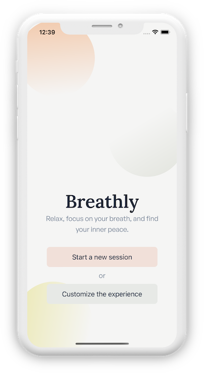

# Breathly in the Lyre marketplace

This is a public source fork of [mmazzarolo/breathly-app](https://github.com/mmazzarolo/breathly-app), curated for the Lyre marketplace. Original authorship, branding and license are retained; it is not an original Lyre app or a new Lyre-published store binary.

Upstream source checkpoint: `4107588b8c8bca076cedf4638b5a2fe53945b80e`. License: **MPL-2.0**. GitHub stars when reviewed September 10, 2026: **596**.



The screenshot is copied unchanged from upstream `.github/iphone-1.png` at that checkpoint. It is upstream presentation artwork, not evidence of a new Lyre device test.

## Use the released app

[Original author's iOS release](https://apps.apple.com/us/app/breathly/id1454852966) · [Original author's Android release](https://play.google.com/store/apps/details?id=com.mmazzarolo.breathly)

These links go to the original author's listings. Store binaries may differ from this source checkpoint.

## Develop the source

This checkout targets Expo 57 and React Native 0.86. Install Bun and use the committed lockfile:

```sh
bun install --frozen-lockfile
bun run start
```

The source includes native modules and an Expo development-client configuration; a browser preview does not prove native behavior. Android development requires the Android SDK; iOS requires macOS/Xcode. Existing `bun run android` / `bun run ios` scripts create native development builds. Those commands were not run for this listing.

Upstream checks include `bun run test`, `bun run typecheck`, `bun run lint`, and Maestro native flows. Do not run EAS submission scripts against the original author's project; use your own identity and signing configuration for a separately released app.

The original MPL-2.0 license and source remain intact. README.md records third-party asset origins, including commissioned audio and screenshot presentation tools. Retain notices and review those asset terms before a separately branded binary distribution; this listing does not relicense them as MIT.

## Lyre boundary

Open the repository as source and follow its own setup. Merely listing this app does not add its native modules to the Lyre companion, install it, grant host access, configure signing or certify remote preview compatibility. No native build, device installation, credential access or store submission was performed in this marketplace task.

Use the original license and notices when adapting or redistributing the source. Upstream app terms and identities do not become Lyre's subscription, privacy or release policy.
